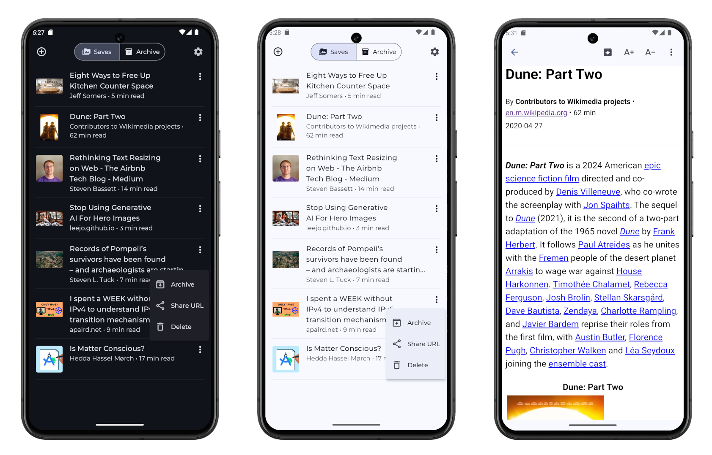

# Savr

Savr is an app for saving online content to read later. It is file-centric, offline first, future proof, and favors decentralization. Read about the design and motivation in the FAQ below.

This repository is for the android app.

# Features

- Save articles for reading later
- Remove distractions like advertisements
- Read content without an internet connection
- Share articles with friends
- No dependency on a service/company to do the scraping or storage
- Scraped content works well outside the app (plain html and images)
- Plays well with file synchronization across devices. Just BYOB (bring your own backend).

# Use

When reading an article in a browser, share it to Savr. Then open Savr later to read it.

If you want to synchronize your articles for backup or for use across devices, just point your synchronization service to the Savr data directory.

Use something like [Nextcloud](https://nextcloud.com/) for a centralized option or [Syncthing](https://syncthing.net/) for a decentralized one. Or use a third party service like Google Drive.

# Current state of development

Basic features have been implemented (scraping, viewing, sharing, archiving, dark theme), but I would consider this in alpha. It still has a bunch of rough edges and needs work on features, bugs, and styling.

# Installation

Since this is pre-release software, I have not put it in any app store. For now you can do one of the following:

- [Install the APK directly from the relases page](https://github.com/jonocodes/savr-android/releases/latest).
- Use [Obtanium](https://obtainium.imranr.dev/) with the source URL: https://github.com/jonocodes/savr-android

# Development

Uses Kotlin and depends heavily on the Storage Access Framework and Android WebView.

Build and debug using Andoid Studio.

More details TBD...

# FAQ

## Why another read-it-later app?

I consider myself a self-hosting enthusiast, who does not like to self-host :smile:. I love open source and open formats, but I dont think every single purpose app should require a custom backend for it.

After using Pocket for 10+ years I decided it was time to take control of my own content collection. But why does Pocket need a special backend? Yes, it helps scrape the articles, but for the most part its just an API that handles authorization and storing content. Moving the scraping into the mobile app makes the backend no longer necessary.

Good examples of apps that work well with filesystems and open data formats are [Obsidian](https://obsidian.md/) (for notes) and [Keepass](https://keepass.info/) (for passwords). You can run them on mobile, or desktop. All the functionality is in the app and a server is not required.

Of course you can bring in a sync service if you want, but its up to you how you want to store things. Syncing would happen outside the app, which adds flexibility. My preference is to use Syncthing which provides a decentralized solution to sync data across my devices/machines.

Generally, **I would like more apps that exist in this space**. Like:
calendar, contacts, bookmark manager, and yes another todo app.

## Why not use an existing open source project?

There are some great projects like [Wallabag](https://wallabag.org/) and [Omnivore](https://github.com/omnivore-app/omnivore), but they require centralized hosting. Doing away with the server lets you not have to worry about:

- security
- certificates
- passwords
- redundancy
- uptime
- firewalls
- DNS
- authorization
- all the other things that come with system administration

## Is there a iOS app?

We need to figure out how to deal with the filesystem restrictions. Possibly use OS-provided storage providers a la [keepassium](https://github.com/keepassium/KeePassium#automatic-sync).

## Is there a desktop app?

A web app, API, and desktop app are in the works.
